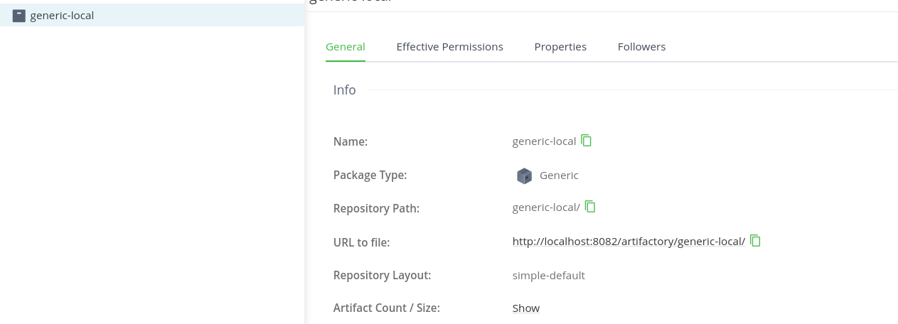
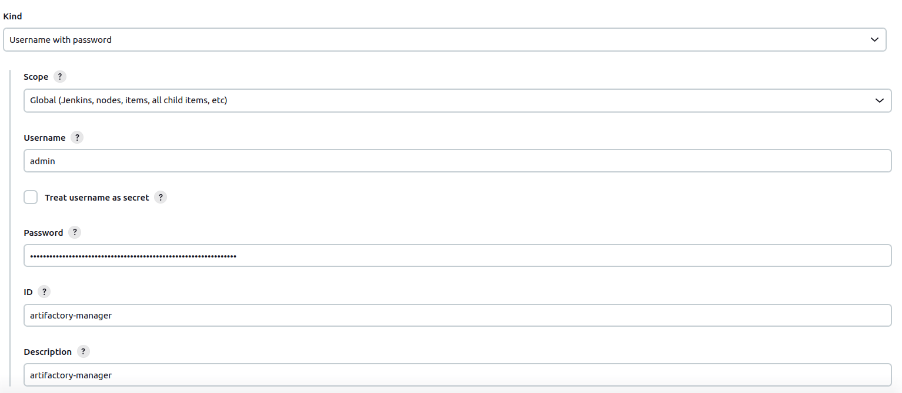
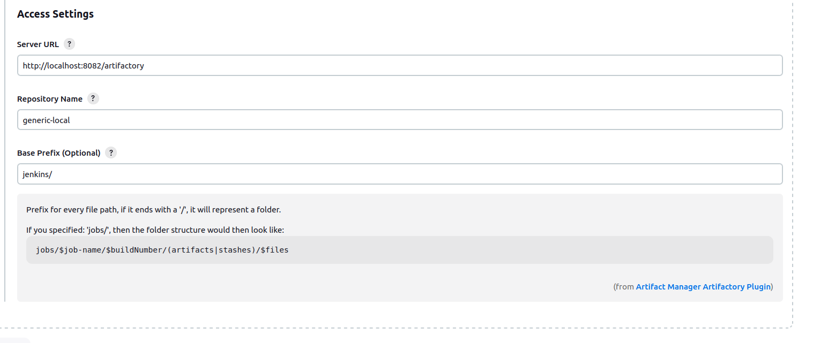
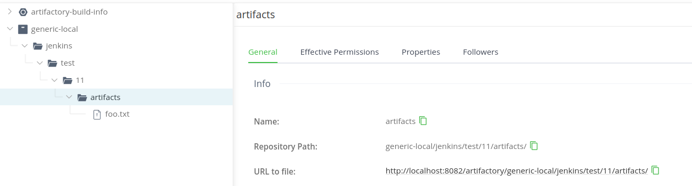

# Artifact Manager on Artifactory Jenkins plugin

> [!NOTE]
> This plugin is maintained by the Jenkins Community and not by JFrog.

  

Artifact Manager on Artifactory plugin is an Artifact Manager that allow you to store your artifacts into a generic repository on Artifactory.
The use of this Artifactory repository as an Artifact storage is transparent to Jenkins and your jobs, it works like the default
Artifact Manager.

## Introduction

This plugin is similar to [artifact-manager-s3](https://plugins.jenkins.io/artifact-manager-s3/) and 
[azure-artifact-manager](https://plugins.jenkins.io/azure-artifact-manager/) but for JFrog Artifactory as backend.

Artifact are stored in a [generic](https://jfrog.com/help/r/jfrog-artifactory-documentation/generic-repositories) repository on Artifactory.

The plugin support both OSS and Pro versions of Artifactory, but Pro version is recommended due to missing REST API on OSS edition. 

> [!IMPORTANT]
> Limitations of OSS edition.

- Not able to move artifact to another location when a job is renamed. Moving must be done manually from Artifactory UI (which is supported on OSS edition).

### Not implemented yet

- Stash/unstash
- Performance optimization with local cache
- Tests coverage

## Configuration

Requirement is to have a generic repository in Artifactory. The plugin will not create it for you.

Then you need to configure a username/password credential in Jenkins.

The plugin is configured in the global Jenkins configuration page.

The plugin works transparently with the default Artifact Manager.

## LICENSE

Licensed under MIT, see [LICENSE](LICENSE.md)

## CONTRIBUTING

See [CONTRIBUTING](CONTRIBUTING.md)
